# Complete Deployment Flow - All-in-One Diagram

This is a single, comprehensive diagram showing the entire deployment process from source code to running Lambda in AWS.

## Copy-Paste Ready Mermaid Code

Copy everything between the triple backticks:

```mermaid
graph TB
    %% ========== PHASE 0: SETUP ==========
    Dev[👨‍💻 Developer<br/>Writes TypeScript]

    %% ========== PHASE 1: DEPENDENCY INSTALLATION ==========
    subgraph Phase1["📦 PHASE 1: Install Dependencies (yarn install)"]
        direction TB
        Install1[Read package.json]
        Install2{yarn.lock<br/>exists?}
        Install3[Use locked versions]
        Install4[Resolve version ranges]
        Install5[Download from npm registry:<br/>- @aws-sdk/*<br/>- typescript<br/>- esbuild<br/>- archiver]
        Install6[Extract to node_modules/]
        Install7[Create/update yarn.lock]

        Install1 --> Install2
        Install2 -->|Yes| Install3
        Install2 -->|No| Install4
        Install3 --> Install5
        Install4 --> Install5
        Install5 --> Install6
        Install6 --> Install7
    end

    %% ========== PHASE 2: TYPESCRIPT COMPILATION ==========
    subgraph Phase2["⚙️ PHASE 2: Compile TypeScript (yarn build)"]
        direction TB
        Compile1[Read tsconfig.json]
        Compile2[TypeScript Compiler tsc]
        Compile3[Read src/handlers/*.ts]
        Compile4[Read src/config/index.ts]
        Compile5[Read src/types/index.ts]
        Compile6[Type checking]
        Compile7[Emit JavaScript]
        Compile8[dist/handlers/*.js]
        Compile9[dist/config/index.js]
        Compile10[dist/types/index.js]

        Compile1 --> Compile2
        Compile2 --> Compile3
        Compile2 --> Compile4
        Compile2 --> Compile5
        Compile3 --> Compile6
        Compile4 --> Compile6
        Compile5 --> Compile6
        Compile6 --> Compile7
        Compile7 --> Compile8
        Compile7 --> Compile9
        Compile7 --> Compile10
    end

    %% ========== PHASE 3: BUNDLING ==========
    subgraph Phase3["📦 PHASE 3: Bundle with esbuild (yarn build:lambda)"]
        direction TB
        Bundle1[Execute build-lambda.js]
        Bundle2[esbuild: Read dist/handlers/transcription.js]
        Bundle3[Follow imports:<br/>- dist/config/index.js<br/>- node_modules/@aws-sdk/*<br/>- node_modules/@smithy/*]
        Bundle4[Tree-shake unused code]
        Bundle5[Minify & compress]
        Bundle6[Output: deploy-bundled/transcription/index.js<br/>113 KB single file]
        Bundle7[Create ZIP:<br/>lambda-transcription-bundled.zip]
        Bundle8[Repeat for persistence 195 KB]
        Bundle9[Repeat for retrieval 139 KB]

        Bundle1 --> Bundle2
        Bundle2 --> Bundle3
        Bundle3 --> Bundle4
        Bundle4 --> Bundle5
        Bundle5 --> Bundle6
        Bundle6 --> Bundle7
        Bundle7 --> Bundle8
        Bundle8 --> Bundle9
    end

    %% ========== PHASE 4: AWS DEPLOYMENT ==========
    subgraph Phase4["☁️ PHASE 4: Deploy to AWS (yarn deploy:all)"]
        direction TB
        Deploy1[AWS CLI: Read credentials]
        Deploy2[Authenticate with AWS]
        Deploy3[Read lambda-transcription-bundled.zip]
        Deploy4[Upload via HTTPS to Lambda API]
        Deploy5[Lambda: Validate ZIP]
        Deploy6[Lambda: Extract index.js]
        Deploy7[Lambda: Store in internal S3]
        Deploy8[Lambda: Update metadata<br/>CodeSize: 116018<br/>Handler: index.handler]
        Deploy9[Deploy persistence Lambda]
        Deploy10[Deploy retrieval Lambda]

        Deploy1 --> Deploy2
        Deploy2 --> Deploy3
        Deploy3 --> Deploy4
        Deploy4 --> Deploy5
        Deploy5 --> Deploy6
        Deploy6 --> Deploy7
        Deploy7 --> Deploy8
        Deploy8 --> Deploy9
        Deploy9 --> Deploy10
    end

    %% ========== PHASE 5: RUNTIME ==========
    subgraph Phase5["🚀 PHASE 5: Lambda Runtime in AWS"]
        direction TB
        Runtime1[Event triggers Lambda<br/>SQS/S3/API Gateway]
        Runtime2{Container<br/>warm?}
        Runtime3[Cold Start:<br/>Create container<br/>Initialize Node.js 20]
        Runtime4[Download index.js 113 KB<br/>~30-50ms]
        Runtime5[Load JavaScript<br/>Initialize AWS SDK]
        Runtime6[Container warm ✅]
        Runtime7[Invoke: handler event]
        Runtime8[Execute business logic]
        Runtime9[Call AWS services:<br/>Bedrock/DynamoDB/S3]
        Runtime10[Return response]

        Runtime1 --> Runtime2
        Runtime2 -->|No| Runtime3
        Runtime2 -->|Yes| Runtime7
        Runtime3 --> Runtime4
        Runtime4 --> Runtime5
        Runtime5 --> Runtime6
        Runtime6 --> Runtime7
        Runtime7 --> Runtime8
        Runtime8 --> Runtime9
        Runtime9 --> Runtime10
    end

    %% ========== CONNECTIONS BETWEEN PHASES ==========
    Dev --> Install1
    Install7 --> Compile1
    Compile10 --> Bundle1
    Bundle9 --> Deploy1
    Deploy10 --> Runtime1

    %% ========== SIZE COMPARISON ==========
    subgraph Metrics["📊 Performance Metrics"]
        direction LR
        Before["Before Bundling:<br/>22 MB<br/>3,038 files<br/>2-3s cold start"]
        After["After Bundling:<br/>113-195 KB<br/>1 file<br/>0.6-0.8s cold start"]
        Improvement["99.5% smaller<br/>70% faster"]

        Before -.->|esbuild| Improvement
        Improvement -.-> After
    end

    %% ========== STYLING ==========
    style Dev fill:#e1f5ff,stroke:#0066cc,stroke-width:3px
    style Phase1 fill:#fff3cd,stroke:#ffcc00,stroke-width:2px
    style Phase2 fill:#d1ecf1,stroke:#0099cc,stroke-width:2px
    style Phase3 fill:#d4edda,stroke:#28a745,stroke-width:2px
    style Phase4 fill:#f8d7da,stroke:#dc3545,stroke-width:2px
    style Phase5 fill:#d4edda,stroke:#28a745,stroke-width:3px
    style Metrics fill:#e7e7e7,stroke:#666666,stroke-width:2px

    style Install7 fill:#28a745,color:#fff
    style Compile10 fill:#28a745,color:#fff
    style Bundle9 fill:#28a745,color:#fff
    style Deploy10 fill:#28a745,color:#fff
    style Runtime10 fill:#28a745,color:#fff

    style Before fill:#f8d7da
    style After fill:#d4edda
    style Improvement fill:#fff3cd
```



---

## How to Use

### Option 1: Mermaid Live Editor
1. Go to https://mermaid.live/
2. Copy the entire code block above (from `graph TB` to the last ` ``` `)
3. Paste into the editor
4. View the complete flow diagram

### Option 2: GitHub
1. Create a markdown file
2. Wrap the code in triple backticks with `mermaid` language tag:
   ````
   ```mermaid
   [paste the code here]
   ```
   ````
3. GitHub will render it automatically

### Option 3: VS Code
1. Install "Markdown Preview Mermaid Support" extension
2. Create a `.md` file with the mermaid code block
3. Press `Ctrl+Shift+V` (Windows) or `Cmd+Shift+V` (Mac)

---

## What This Diagram Shows

**Left to Right Flow:**
1. **Developer** writes TypeScript code
2. **Phase 1 (Yellow)**: yarn install - Downloads dependencies from npm
3. **Phase 2 (Blue)**: yarn build - Compiles TypeScript → JavaScript
4. **Phase 3 (Green)**: yarn build:lambda - Bundles everything into single files
5. **Phase 4 (Red)**: yarn deploy:all - Uploads to AWS Lambda
6. **Phase 5 (Green)**: Lambda runs in AWS, handles events

**Performance Metrics (Bottom):**
- Shows the 99.5% size reduction from bundling
- Cold start improvement: 2-3s → 0.6-0.8s

**Color Coding:**
- 🔵 Blue: Compilation phase
- 🟡 Yellow: Dependency management
- 🟢 Green: Bundling & runtime (success states)
- 🔴 Red: Deployment (external AWS interaction)
- ⚪ Gray: Metrics/comparison

---

## Alternative: Simplified Version

If the diagram above is too complex, here's a simplified version:


