# Lambda Deployment Flow - Complete Process

This document visualizes the entire deployment process from source code to AWS Lambda using Mermaid diagrams.

## Overview: Full Deployment Pipeline

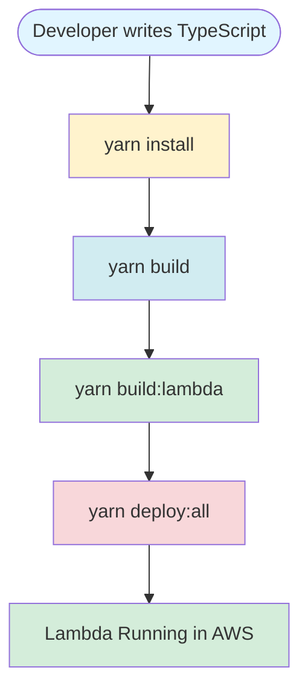

---

## Phase 1: Dependency Installation (yarn install)

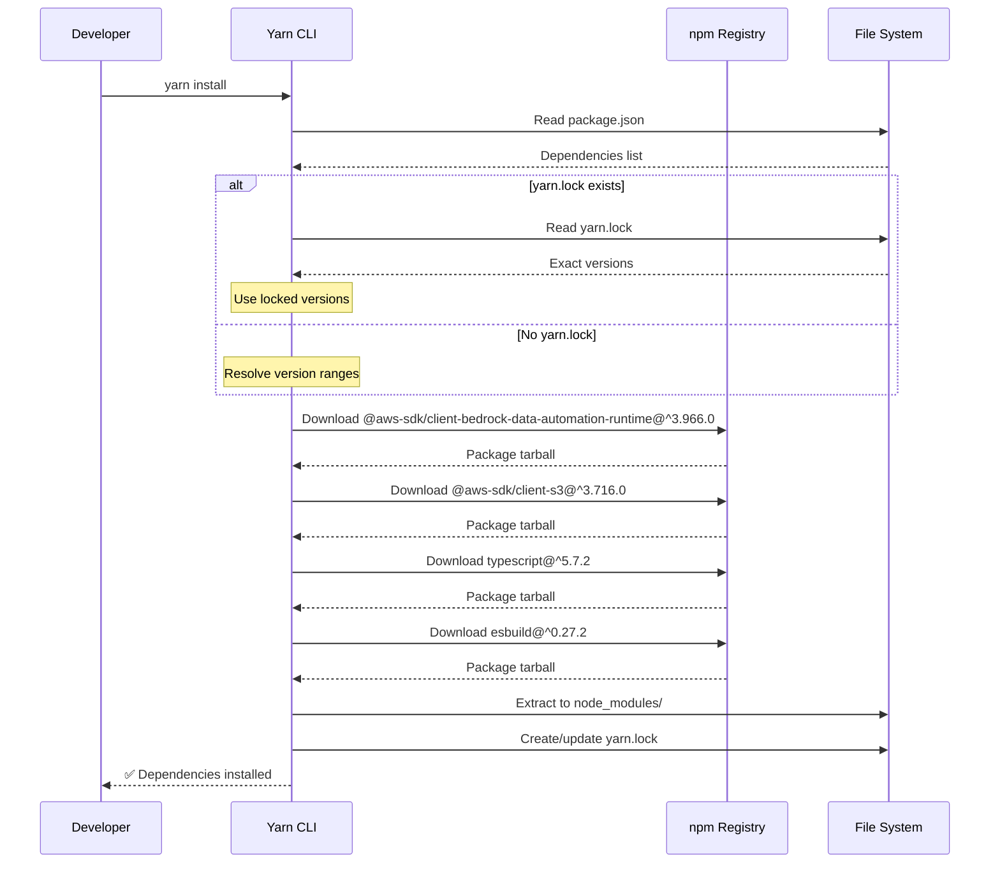

### Detailed Dependency Tree

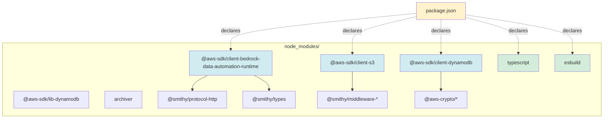

---

## Phase 2: TypeScript Compilation (yarn build)

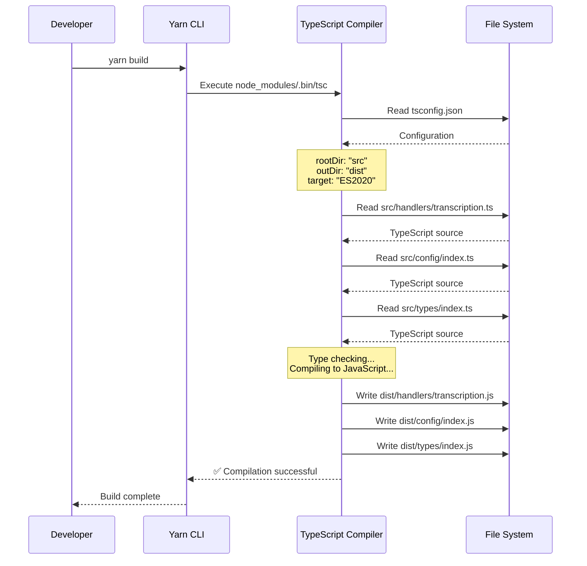

### File Transformation Flow

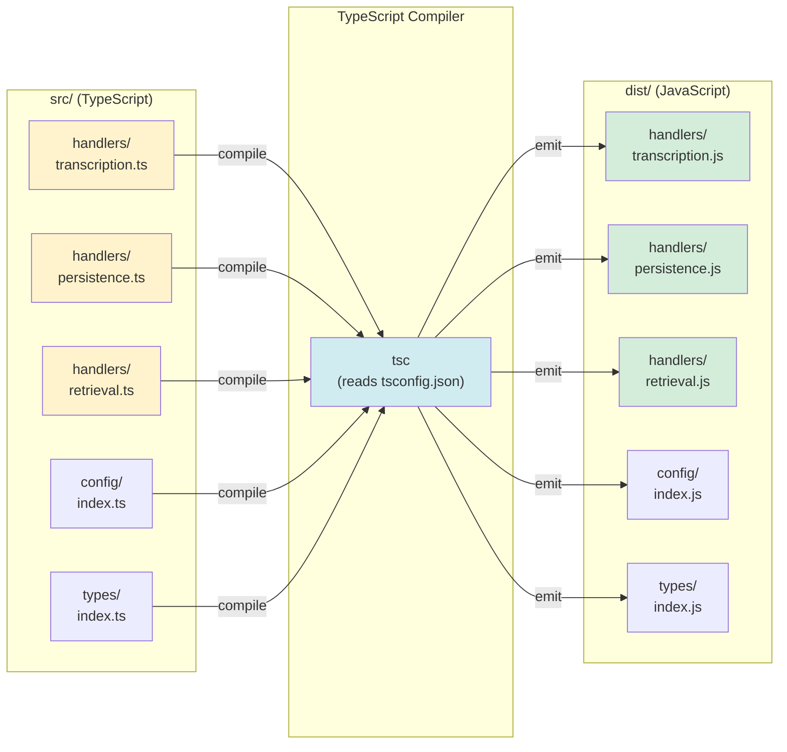

---

## Phase 3: Lambda Bundling (yarn build:lambda)

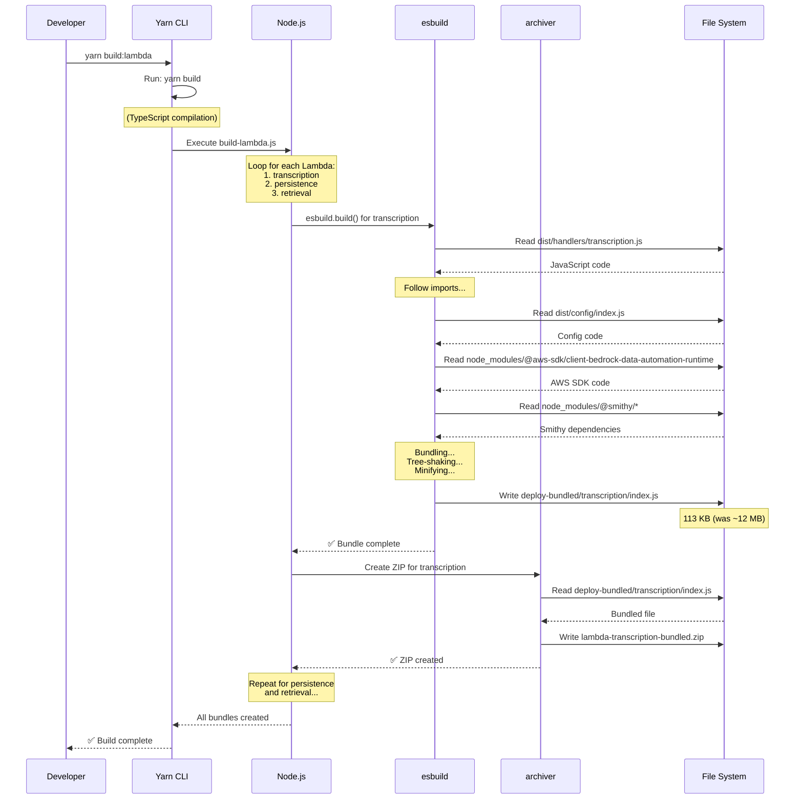

### esbuild Bundling Process (Detailed)

```mermaid
graph TB
    subgraph "Entry Point"
        Entry["dist/handlers/<br/>transcription.js<br/>(2 KB)"]
    end

    subgraph "Dependencies Discovery"
        Entry --> Import1["import config from<br/>'../config'"]
        Entry --> Import2["import BedrockClient from<br/>'@aws-sdk/...'"]
        Entry --> Import3["import crypto from<br/>'crypto'"]

        Import1 --> Config["dist/config/index.js<br/>(1 KB)"]
        Import2 --> SDK["node_modules/@aws-sdk/<br/>client-bedrock-...<br/>(10 MB)"]
        SDK --> Smithy["@smithy/*<br/>(2 MB)"]
        Import3 --> NodeBuiltin["Node.js built-in<br/>(excluded)"]
    end

    subgraph "esbuild Processing"
        Config --> Bundle["Bundle & Inline"]
        SDK --> Bundle
        Smithy --> Bundle
        Bundle --> TreeShake["Tree Shake<br/>(Remove unused code)"]
        TreeShake --> Minify["Minify<br/>(Compress)"]
    end

    subgraph "Output"
        Minify --> Output["deploy-bundled/<br/>transcription/<br/>index.js<br/>(113 KB)"]
    end

    style Entry fill:#fff3cd
    style SDK fill:#f8d7da
    style Bundle fill:#d1ecf1
    style TreeShake fill:#d1ecf1
    style Minify fill:#d1ecf1
    style Output fill:#d4edda
```

### Bundle Size Reduction

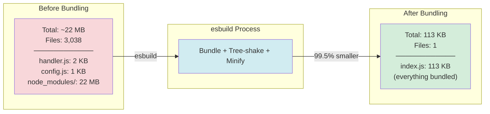

---

## Phase 4: AWS Deployment (yarn deploy:all)

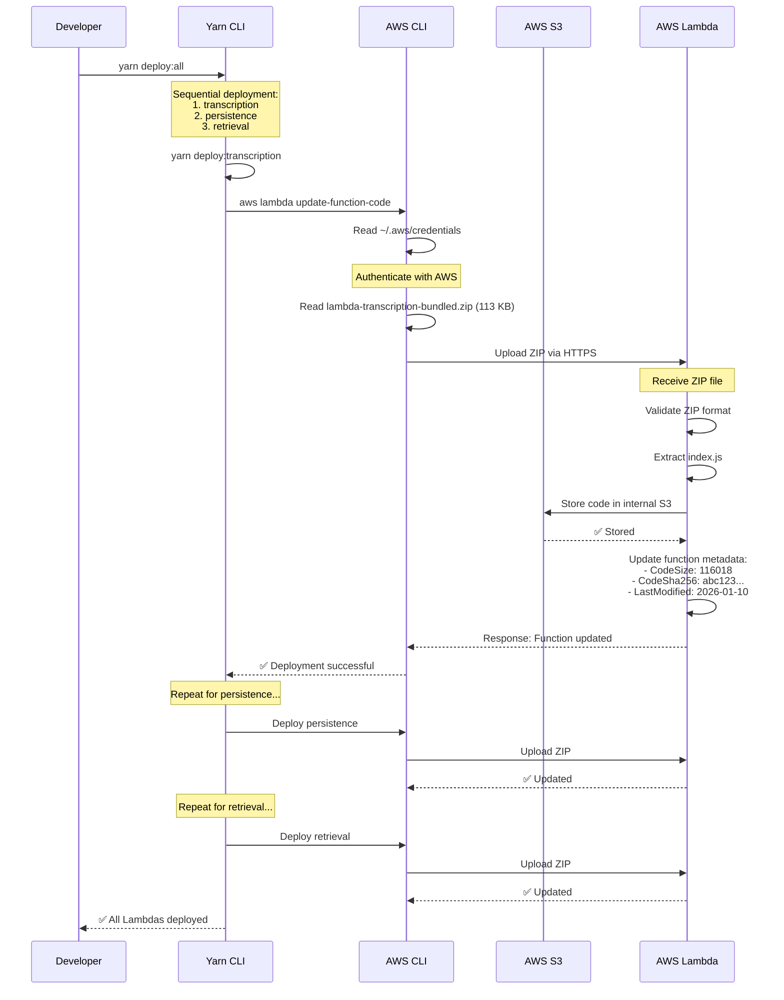

### AWS Lambda Update Process

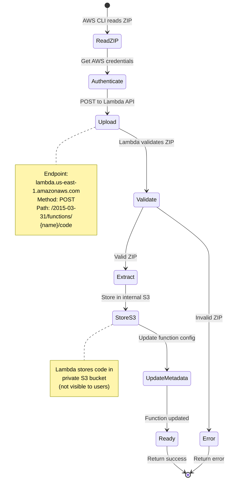

---

## Complete End-to-End Flow

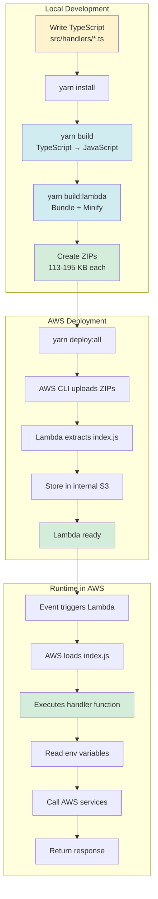

---

## Data Flow: From TypeScript to Running Lambda

```mermaid
flowchart TD
    Start([Developer Code]) --> TS[TypeScript Files<br/>src/**/*.ts]

    TS -->|tsc compiler| JS[JavaScript Files<br/>dist/**/*.js]

    JS -->|esbuild reads| Bundle{esbuild Bundler}
    NM[node_modules/<br/>@aws-sdk/*] -->|esbuild reads| Bundle

    Bundle -->|process| Inline[Inline all imports]
    Inline --> TreeShake[Remove unused code]
    TreeShake --> Minify[Compress & minify]

    Minify --> Single[Single File<br/>deploy-bundled/*/index.js<br/>113 KB]

    Single -->|archiver| ZIP[ZIP File<br/>lambda-*-bundled.zip]

    ZIP -->|AWS CLI upload| Cloud{AWS Lambda Service}

    Cloud -->|extract| Store[Store in S3]
    Cloud -->|metadata| Meta[Update function config]

    Store --> Ready[Lambda Ready]
    Meta --> Ready

    Ready -->|event triggers| Execute[Execute handler]

    Execute --> Output([Response])

    style TS fill:#fff3cd
    style JS fill:#d1ecf1
    style Bundle fill:#d1ecf1
    style Single fill:#d4edda
    style Ready fill:#d4edda
    style Execute fill:#d4edda
```

---

## File Size Transformation

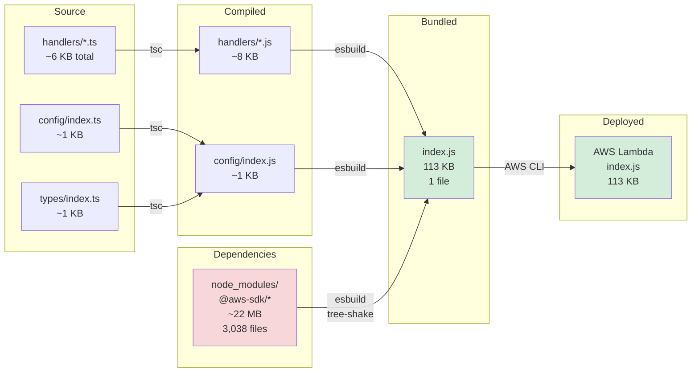

---

## Deployment Script Execution

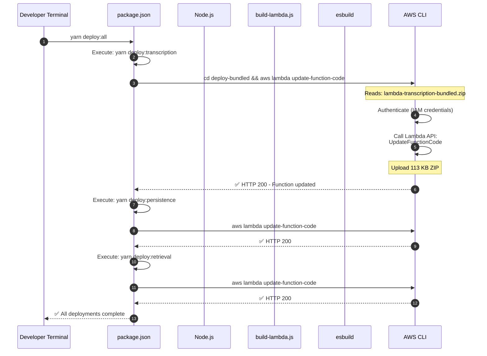

---

## Lambda Cold Start (After Deployment)

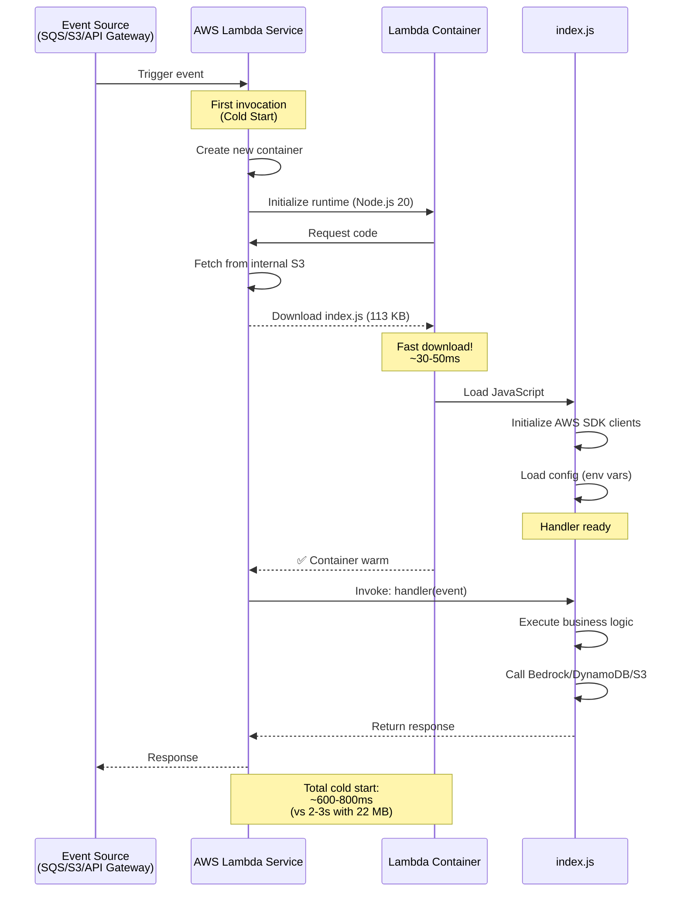

---

## Summary: Why Bundling Matters

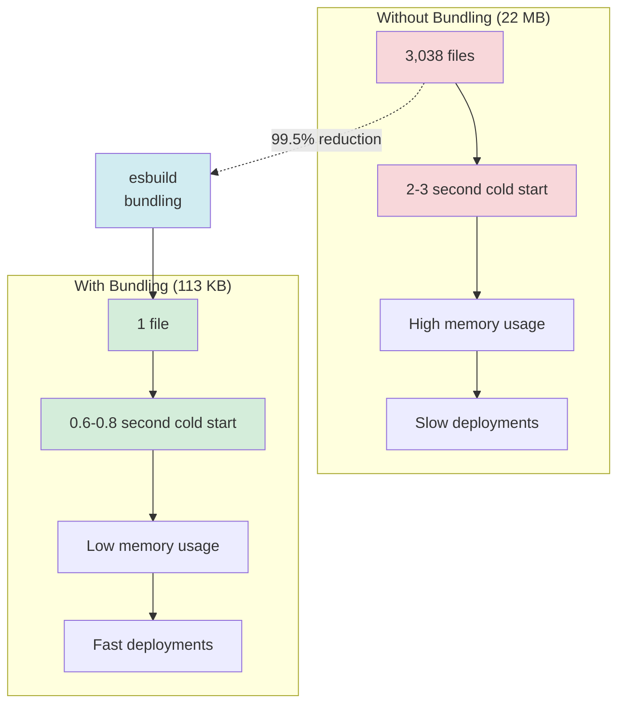

---

## Commands Reference

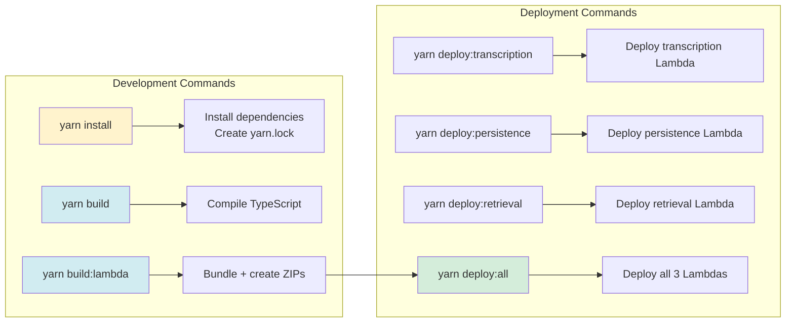
