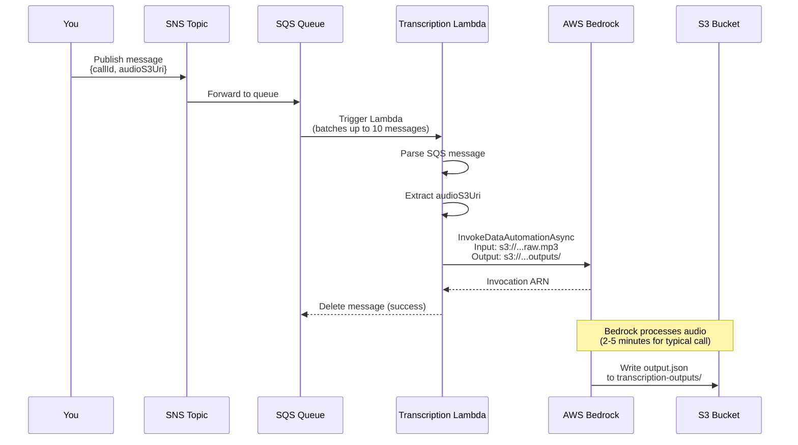
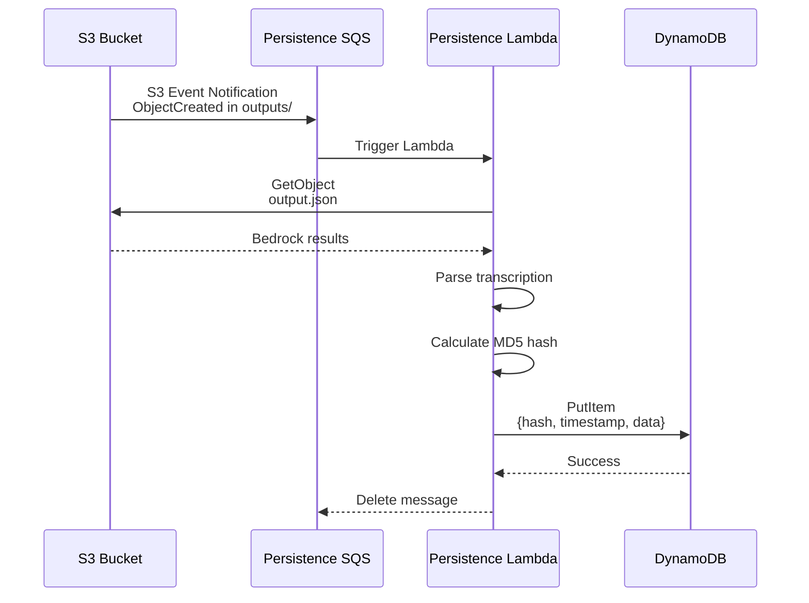
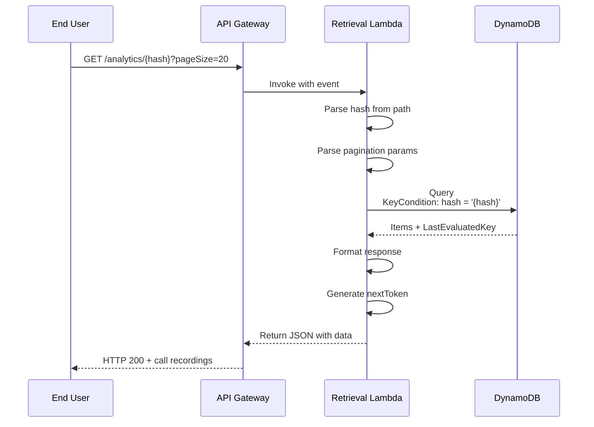

# What Happens When You Drop an Audio File in S3?

Complete step-by-step flow from audio file upload to searchable analytics.

---

## 🎯 Quick Answer

**Short version**: Nothing automatic happens yet! You need to **manually trigger** the transcription process by publishing a message to SNS.

**Why?**: There's currently **no S3 event notification** configured to automatically trigger transcription when audio files are uploaded.

---

## 📋 Current Architecture

### What You Have:

```
S3 Bucket (pgr-experiment-data)
├── raw-audio-files/          ← You drop audio here
│   └── call-001.mp3
└── transcription-outputs/     ← Bedrock outputs go here
    └── call-001/
        └── output.json
```

### What Happens Now:

**Step 1**: You upload audio file
```bash
aws s3 cp my-audio.mp3 s3://pgr-experiment-data/raw-audio-files/call-001.mp3
```

**Result**: File sits in S3. **Nothing happens automatically.**

---

## 🚀 How to Trigger the Pipeline (Manual Method)

Since there's no automatic trigger, you need to **manually publish an SNS message**:

### Step-by-Step Manual Trigger:

**1. Upload your audio file to S3**
```bash
aws s3 cp my-audio-file.mp3 s3://pgr-experiment-data/raw-audio-files/my-call.mp3
```

**2. Publish SNS message to trigger transcription**
```bash
aws sns publish \
  --topic-arn arn:aws:sns:us-east-1:488786173548:dmg-inbound-callrecording-transcript \
  --message '{
    "callId": "my-call-001",
    "audioS3Uri": "s3://pgr-experiment-data/raw-audio-files/my-call.mp3"
  }' \
  --region us-east-1
```

**3. The pipeline starts!**

---

## 🔄 Complete Pipeline Flow (After SNS Trigger)

Once you publish the SNS message, here's the complete flow:

### Phase 1: Transcription (0-5 minutes)



**Step 1.1**: You publish SNS message
- Topic: `dmg-inbound-callrecording-transcript`
- Message contains:
  - `callId`: Unique identifier for this call
  - `audioS3Uri`: S3 location of audio file

**Step 1.2**: SNS forwards to SQS
- Queue: `dmg-inbound-callrecording-transcription-sqs-queue`
- Message buffered in queue

**Step 1.3**: SQS triggers Transcription Lambda
- Lambda polls SQS every few seconds
- Batches up to 10 messages
- Invokes Lambda with batch

**Step 1.4**: Transcription Lambda executes
- Parses SQS message body
- Extracts SNS message from body
- Parses `callId` and `audioS3Uri`
- Validates S3 URI format

**Step 1.5**: Lambda invokes Bedrock Data Automation
- API Call: `InvokeDataAutomationAsyncCommand`
- Parameters:
  ```javascript
  {
    inputConfiguration: {
      s3Uri: "s3://pgr-experiment-data/raw-audio-files/my-call.mp3"
    },
    outputConfiguration: {
      s3Uri: "s3://pgr-experiment-data/transcription-outputs/my-call-001/"
    },
    dataAutomationProjectArn: "arn:aws:bedrock:us-east-1:488786173548:data-automation-project/...",
    dataAutomationProfileArn: "arn:aws:bedrock:us-east-1:488786173548:data-automation-profile/...",
    clientToken: "uuid-generated-by-lambda"
  }
  ```

**Step 1.6**: Bedrock starts processing
- Downloads audio from S3
- Transcribes speech to text
- Analyzes sentiment, entities, key phrases
- **Time**: 2-5 minutes for typical call recording

**Step 1.7**: Bedrock writes output
- Creates: `s3://pgr-experiment-data/transcription-outputs/my-call-001/output.json`
- File contains:
  - Full transcription
  - Speaker diarization
  - Sentiment analysis
  - Key entities
  - Timestamps

**Step 1.8**: S3 event triggers next phase
- S3 detects new object created in `transcription-outputs/`
- Sends event notification to SQS queue for persistence

---

### Phase 2: Persistence (5-10 seconds)



**Step 2.1**: S3 event notification
- S3 detects: `ObjectCreated:Put` in `transcription-outputs/my-call-001/output.json`
- Sends notification to: `dmg-inbound-callrecording-persistence-sqs-queue`

**Step 2.2**: SQS triggers Persistence Lambda
- Queue delivers S3 event to Lambda
- Event contains:
  - Bucket name
  - Object key
  - Event type
  - Timestamp

**Step 2.3**: Persistence Lambda downloads Bedrock output
- API Call: `S3.GetObject()`
- Bucket: `pgr-experiment-data`
- Key: `transcription-outputs/my-call-001/output.json`
- Downloads JSON file (typically 10-100 KB)

**Step 2.4**: Lambda parses transcription results
- Reads JSON structure
- Extracts:
  - Full transcript text
  - Conversation metadata
  - Sentiment scores
  - Speaker information
  - Key entities mentioned

**Step 2.5**: Lambda calculates hash
- Creates MD5 hash from:
  - Call ID
  - Timestamp
  - Other identifying fields
- Hash used as DynamoDB partition key
- Example: `a3f2b8c9d1e4f5a6b7c8d9e0f1a2b3c4`

**Step 2.6**: Lambda writes to DynamoDB
- Table: `conversational-analytics-dev-call-recordings`
- Item structure:
  ```javascript
  {
    hash: "a3f2b8c9d1e4f5a6b7c8d9e0f1a2b3c4",  // Partition key
    epchdatetimestamp: 1704891600000,          // Sort key
    callId: "my-call-001",
    transcription: "Hello, this is customer service...",
    sentiment: "positive",
    entities: ["customer service", "refund", "order #12345"],
    metadata: {
      duration: 180,
      speakers: 2,
      language: "en-US"
    },
    s3OutputUri: "s3://pgr-experiment-data/transcription-outputs/my-call-001/output.json",
    audioS3Uri: "s3://pgr-experiment-data/raw-audio-files/my-call.mp3",
    createdAt: "2026-01-11T00:30:00Z"
  }
  ```

**Step 2.7**: DynamoDB confirms write
- Item stored successfully
- Now searchable via hash

---

### Phase 3: Retrieval (Instant)



**Step 3.1**: User makes API request
- URL: `https://3qcv9fvb6l.execute-api.us-east-1.amazonaws.com/dev/analytics/a3f2b8c9d1e4f5a6b7c8d9e0f1a2b3c4`
- Query parameters:
  - `pageSize=20` (optional, default: 20)
  - `nextToken=eyJoYXNoIjoi...` (optional, for pagination)

**Step 3.2**: API Gateway triggers Retrieval Lambda
- Extracts hash from URL path
- Passes query parameters
- Invokes Lambda

**Step 3.3**: Retrieval Lambda queries DynamoDB
- API Call: `DynamoDB.Query()`
- Key condition: `hash = 'a3f2b8c9d1e4f5a6b7c8d9e0f1a2b3c4'`
- Sort order: Descending by timestamp (newest first)
- Limit: `pageSize` (default 20, max 100)

**Step 3.4**: DynamoDB returns results
- Items matching the hash
- Sorted by timestamp (newest to oldest)
- `LastEvaluatedKey` if more results exist

**Step 3.5**: Lambda formats response
- Converts DynamoDB format to clean JSON
- Generates `nextToken` if more pages available
- Adds CORS headers

**Step 3.6**: Return to user
```json
{
  "items": [
    {
      "callId": "my-call-001",
      "timestamp": 1704891600000,
      "transcription": "Hello, this is customer service...",
      "sentiment": "positive",
      "duration": 180
    }
  ],
  "count": 1,
  "nextToken": null,
  "hasMore": false
}
```

---

## 📊 Complete Timeline

| Time | Event | Component |
|------|-------|-----------|
| **T+0s** | You publish SNS message | Manual trigger |
| **T+1s** | Message in SQS queue | SNS → SQS |
| **T+2s** | Transcription Lambda starts | SQS → Lambda |
| **T+3s** | Bedrock invocation started | Lambda → Bedrock |
| **T+3-300s** | Bedrock processing audio | Bedrock (2-5 min) |
| **T+300s** | Output written to S3 | Bedrock → S3 |
| **T+301s** | S3 event to persistence queue | S3 → SQS |
| **T+302s** | Persistence Lambda starts | SQS → Lambda |
| **T+303s** | Download Bedrock output | Lambda → S3 |
| **T+304s** | Write to DynamoDB | Lambda → DynamoDB |
| **T+305s** | **COMPLETE!** Data searchable | ✅ |
| **T+305s+** | User can query via API | Instant retrieval |

**Total time: ~5 minutes** (mostly Bedrock processing)

---

## 🛠️ What's Missing: Automatic Trigger

### Current State:

❌ No S3 event notification on `raw-audio-files/` folder
❌ Must manually publish SNS message

### What You Need to Add:

**Option 1: S3 → SNS Trigger (Recommended)**

Add S3 bucket notification to automatically publish to SNS when audio is uploaded:

```hcl
resource "aws_s3_bucket_notification" "audio_upload_trigger" {
  bucket = var.s3_input_bucket_name

  topic {
    topic_arn     = aws_sns_topic.dmg_inbound_callrecording_transcript.arn
    events        = ["s3:ObjectCreated:*"]
    filter_prefix = "raw-audio-files/"
    filter_suffix = ".mp3"
  }
}
```

**Then the flow becomes**:
```
Upload audio → S3 event → SNS → SQS → Transcription Lambda → ...
```

**Option 2: S3 → Lambda Direct**

Skip SNS and trigger Lambda directly from S3:

```hcl
resource "aws_s3_bucket_notification" "audio_upload_trigger" {
  bucket = var.s3_input_bucket_name

  lambda_function {
    lambda_function_arn = aws_lambda_function.dmg_inbound_callrecording_transcription.arn
    events              = ["s3:ObjectCreated:*"]
    filter_prefix       = "raw-audio-files/"
    filter_suffix       = ".mp3"
  }
}
```

---

## 🎯 Summary

### What Happens Now (Manual):

1. ❌ Drop audio in S3 → **Nothing happens**
2. ✅ You publish SNS message → **Pipeline starts**
3. ✅ Transcription → Persistence → Retrieval → **Complete!**

### What Would Happen (With Auto-Trigger):

1. ✅ Drop audio in S3 → **S3 event fires**
2. ✅ S3 → SNS → SQS → **Pipeline starts automatically**
3. ✅ Transcription → Persistence → Retrieval → **Complete!**

### To Enable Automatic Processing:

**Add this Terraform resource** (I can help you with this if you want):

```hcl
# File: terraform/s3_bucket_notification.tf
resource "aws_s3_bucket_notification" "raw_audio_notifications" {
  bucket = var.s3_input_bucket_name

  topic {
    topic_arn     = aws_sns_topic.dmg_inbound_callrecording_transcript.arn
    events        = ["s3:ObjectCreated:Put", "s3:ObjectCreated:Post"]
    filter_prefix = "raw-audio-files/"
    filter_suffix = ".mp3"
  }

  depends_on = [aws_sns_topic_policy.dmg_inbound_callrecording_transcript]
}

# Also need to update SNS policy to allow S3
resource "aws_sns_topic_policy" "allow_s3_publish" {
  arn = aws_sns_topic.dmg_inbound_callrecording_transcript.arn

  policy = jsonencode({
    Version = "2012-10-17"
    Statement = [
      {
        Effect = "Allow"
        Principal = {
          Service = "s3.amazonaws.com"
        }
        Action   = "SNS:Publish"
        Resource = aws_sns_topic.dmg_inbound_callrecording_transcript.arn
        Condition = {
          ArnEquals = {
            "aws:SourceArn" = "arn:aws:s3:::${var.s3_input_bucket_name}"
          }
        }
      }
    ]
  })
}
```

**Then run**:
```bash
terraform plan
terraform apply
```

After this, **simply dropping an audio file in S3 will automatically start the pipeline!**

---

Want me to add the automatic S3 trigger configuration?
